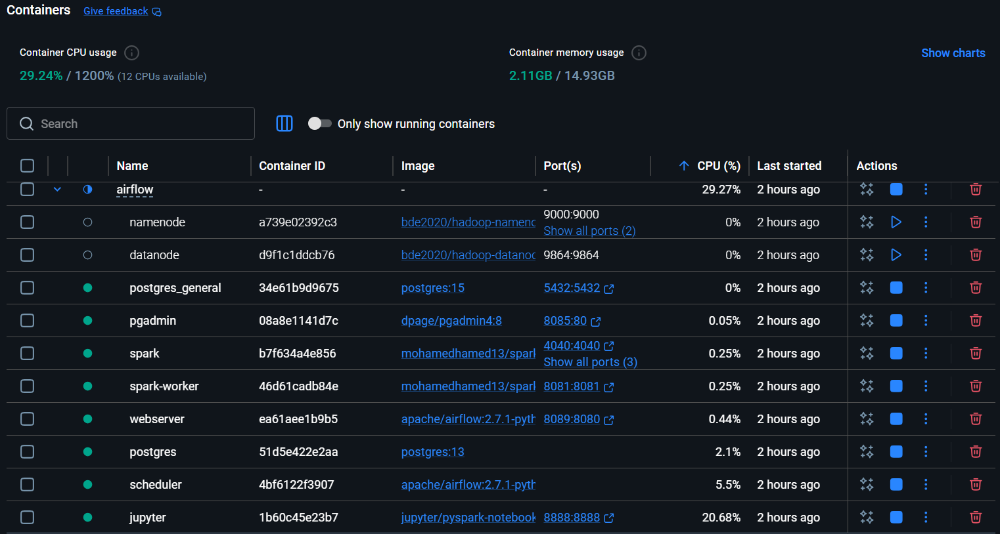
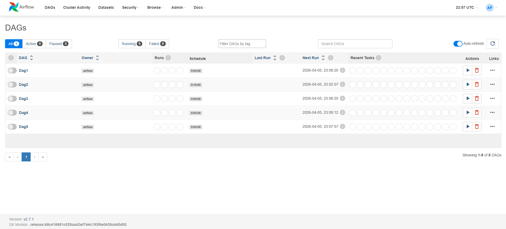

# Airflow Data Engineering Pipeline

This project implements a local data engineering stack using Docker Compose. It orchestrates a multi-node architecture including Apache Airflow for workflow management, PostgreSQL for warehousing, and a Spark/Hadoop framework for distributed processing.

## Project Stack
* **Orchestration:** Apache Airflow 2.7.1
* **Database:** PostgreSQL 13 & 15
* **Processing:** Apache Spark & Hadoop
* **Infrastructure:** Docker Desktop

## System Status
The following image confirms the health of the containerized cluster.

## Airflow Dashboard
The main UI displaying the successful DAG ingestion and transformation pipeline.

## How to Run
1. Ensure Docker Desktop is running.
2. Execute `docker compose -f depi.yaml up -d`.
3. Access Airflow UI at `http://localhost:8089` (Admin/Admin).
